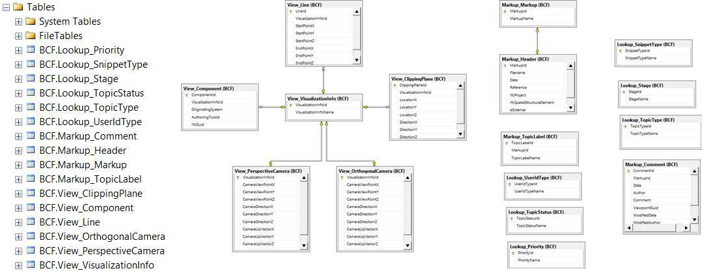

<!-- IfcSharp-documentation, Copyright (c) 2020, Bernhard Simon Bock, Friedrich Eder, MIT License (see https://github.com/IfcSharp/IfcSharpLibrary/tree/master/Licence) --->

# ifcSQL
ifcSQL ist stored here [here](https://github.com/IfcSharp/IfcSQL)

The BCF-implementation in ifcSQL (see ifcSQL_BCF_part_create.sql.txt) look like this: (click on this line)
    

<
