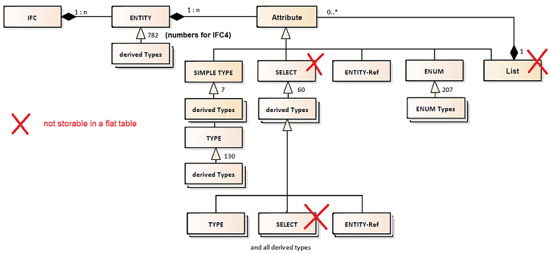

<!-- IfcSharp-documentation, Copyright (c) 2020, Bernhard Simon Bock, Friedrich Eder, MIT License (see https://github.com/IfcSharp/IfcSharpLibrary/tree/master/Licence) --->


# IfcSqlite

## Background

In comparison to [IfcSql](../IfcSql/README.md) this implementation currently does not offer storing data collections (`LIST` and `SELECT`) in a type-save manner.<br>
Types, that are not storable (typesave) in a flat table are stored as a string (at the moment) in the STEP-format.:<br>



### Building from Source

The `IfcSqlite` class implements the reading and writing of the IFC schema to *SQLite* databases.
In order to use *SQLite* you need include the necessary binaries.<br>
The easiest way to do so is via *[NuGet](https://www.nuget.org/packages/SQLite/)*:<br>
`dotnet add package SQLite --version 3.13.0`

Additionally you need to `#define INCLUDE_SQLITE` as a constant in your project. Now you can use the *SQLite* input and output functionality like so:<br>

```csharp
ifc.Repository.CurrentModel.ToSqliteFile();
```
