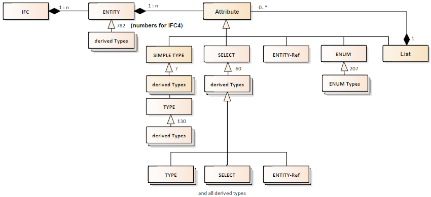

<!-- IfcSharp-documentation, Copyright (c) 2020, Bernhard Simon Bock, Friedrich Eder, MIT License (see https://github.com/IfcSharp/IfcSharpLibrary/tree/master/Licence) --->

# IfcSchema
The folder IfcSchema contains the schema-definition of different IFC-releases as C#-classes.

## Background
The datamodel of the Industry Foundation Classes (IFC) is defined in various releases as EXPRESS-files here: https://technical.buildingsmart.org/standards/ifc/ifc-schema-specifications/

The underlaying meta-concept is shown is this picture:




### In words
A IFC-Model contains entities with attributes.
An attribute are from types of TYPE, SELECT, ENTITY-Ref, ENUM and Lists (of attributes).
SELECT itself can be TYPE, SELECT or ENTITY-Refs.

In IfcSharp the types ENTITY, TYPE, SELECT and ENUM are stored in 4 C#-Files, wich contain the informations of these types.

## Example of an ENTITY-class-defintion in IfcSharp

```csharp
[ifcSql(TypeGroupId:5,TypeId: 472,TableId:3)] public partial class ActorRole:ENTITY{//================================================================================
public               ActorRole():base(){}
public               ActorRole(RoleEnum Role,Label UserDefinedRole=null,Text Description=null,string EndOfLineComment=null):base(){AddNext();this.Role=Role;this.UserDefinedRole=UserDefinedRole;this.Description=Description;this.EndOfLineComment=EndOfLineComment;}
public               ActorRole(RoleEnum Role,string EndOfLineComment=null):base(){AddNext();this.Role=Role;this.EndOfLineComment=EndOfLineComment;}
[ifc(1)] public RoleEnum Role; //ENUM
[ifc(2,optional=true)] public Label UserDefinedRole; //TYPE
[ifc(3,optional=true)] public Text Description; //TYPE
[ifcInverse(For:"RelatedResourceObjects")] public LIST<ExternalReferenceRelationship> HasExternalReference;
}//=====================================================================================================================
```

### In words
The C#-attribute **ifcSql** contains the class-information from the schema-database of ifcSQL.<br/>
TypeGroupId:5 means, that this class decribes an entity<br/>
TypeId: 472 means, that this is type with id-number 472 from the schema-database of ifcSQL<br/>
TableId:3 means, thats this class has the database-storetype of number 3.<br/>

The C#-attribute **ifc** contains the attribute-information from the schema-database of ifcSQL.<br/>
(1) means, that this is the first attribute in the STEP-file-order.<br/>
optional=true indicates, that this attribute is optional<br/>

The C#-attribute **ifcInverse** contains the inverse-information from the schema-database of ifcSQL.<br/>
For:"RelatedResourceObjects" decribe the name of the relating element.

