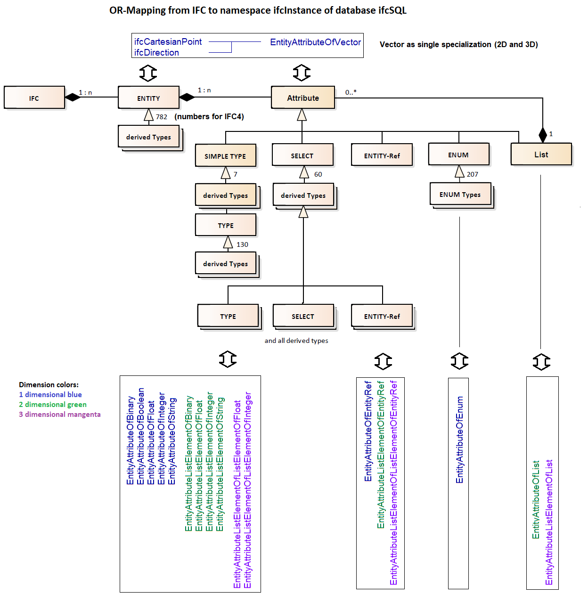
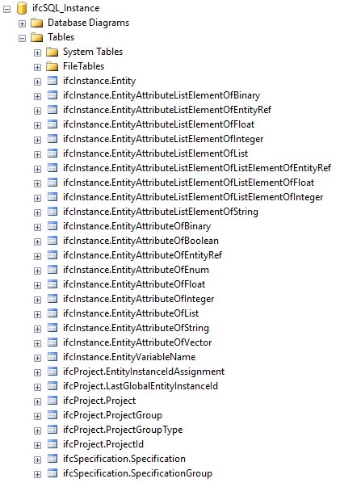
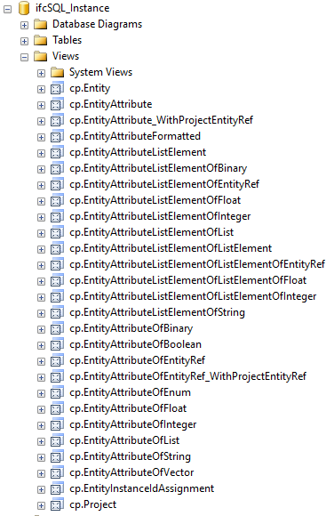

<!-- IfcSharp-documentation, Copyright (c) 2020, Bernhard Simon Bock, Friedrich Eder, MIT License (see https://github.com/IfcSharp/IfcSharpLibrary/tree/master/Licence) --->

# ifcSQL

# Background

The underlaying concept of ifcSQL is shown is this picture:

### In words
A IFC-model contains entities with attributes.
An attribute can be of TYPE, SELECT, ENTITY-Ref, ENUM and List (of attributes).
SELECT itself can be TYPE, SELECT or ENTITY-Refs.

In ifcSQL every base-type is mapped to a separate table.

To create the instance-part of the ifcSQL-database, you can use the SQL-script **ifcSQL_Instance_create.sql**, wich is testet on Microsoft SQL-Server.

SQL-script creates
1. schemata (used as namespaces)
2. user defined types (for describing meaning of types)
3. tables with minimal referential integrity.
4. views
5. a scalar function for the current project
6. a stored procedure preserving globalId-space

The result should look like this for tables

and like this for view:

