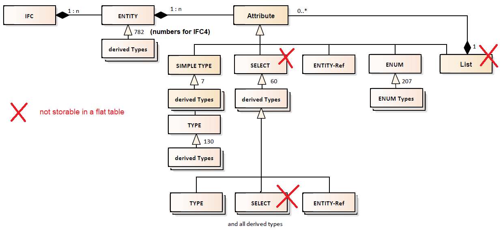

<!-- IfcSharp-documentation, Copyright (c) 2020, Bernhard Simon Bock, Friedrich Eder, MIT License (see https://github.com/IfcSharp/IfcSharpLibrary/tree/master/Licence) --->

# ifcSQLite

## Background

The underlaying concept of ifcSQLite is shown is this picture:

### In words
A IFC-Model contains entities with attributes.
An attribute can be of TYPE, SELECT, ENTITY-Ref, ENUM and List (of attributes).
SELECT itself can be TYPE, SELECT or ENTITY-Refs.

In ifcSQLite every entity have its own table an every attribute have its own type.

Types, that are not storable (typesave) in a flat table are stored as a string (at the moment) in the STEP-format.
